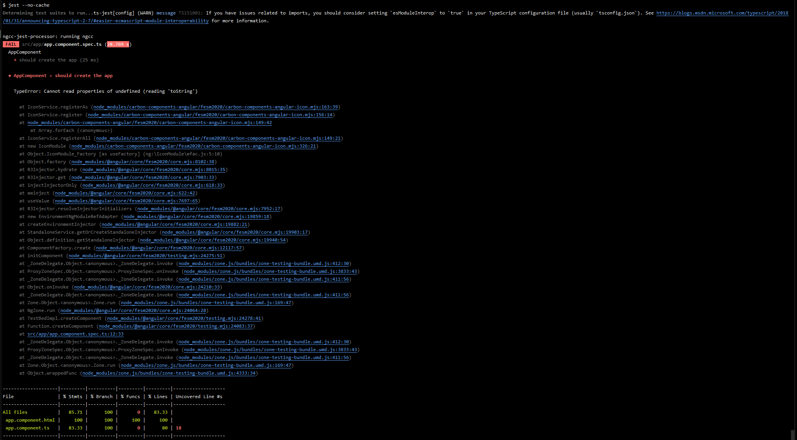

# Angular with jest and carbon design
I'm testing out the new version of carbon-components-angular v5 with angular 15 
and jest 29 and in contrary to carbon-components-angular v4 it's breaking the tests.

The test always breaks when I include the IconService (or UIShell) somewhere.

I don't know how to fix this and need help here.

Thanks for any help in advance.

